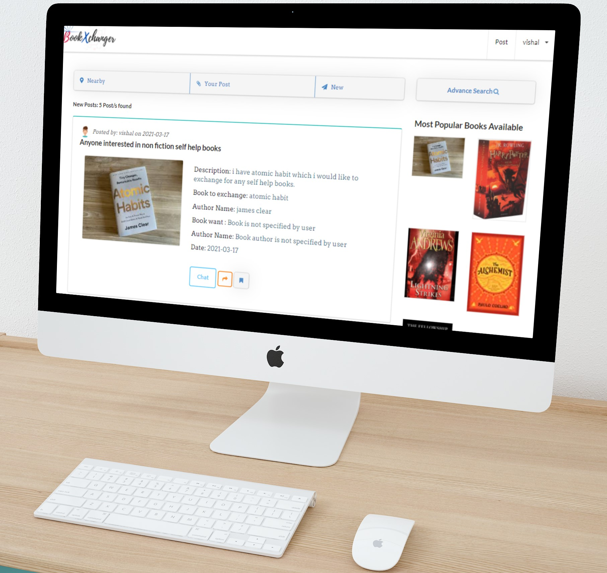

<!-- PROJECT LOGO -->
<br />
<p align="center">
  <a href="https://bookxchanger.ninja">
    
  </a>
  <p align="center">
    Swap/Exchange  Books For Free!
    <br />
    <a href="https://github.com/vishalmanes109/BookExchanger/tree/master/src"><strong>Explore the codebase »</strong></a>
    <br />
    <br />
    <a href="https://bookxchanger.ninja/">Visit Live Website</a>
    ·
    <a href="https://github.com/vishalmanes109/BookExchanger/issues">Report Bug</a>
    ·
    <a href="https://github.com/vishalmanes109/BookExchanger/issues">Request Feature</a>
    ·
    <a href="https://www.youtube.com/watch?v=8_v5QmKua78">Watch Video</a>
  </p>
  
</p>


<!-- TABLE OF CONTENTS -->
## Table of Contents

* [About the Project](#about-the-project)
  * [Built With](#built-with)
* [Getting Started](#getting-started)
  * [Prerequisites](#prerequisites)
  * [Installation](#installation)
* [Usage](#usage)
* [Roadmap](#roadmap)
* [Contributing](#contributing)
* [License](#license)
* [Contact](#contact)
* [More](#More)


<!-- ABOUT THE PROJECT -->
## About The Project

### BookXchanger:
* What is BookXchanger?
BookXchanger is the place to swap/exchange/trade your books. Our goal is to allow people to easily trade books that have been collecting dust on their bookshelves for books they want for free.
`vishalmanes109`, `BookXchanger`, `Swap/Exchanger Books`
    
<h3><a href="https://bookxchanger.ninja/"> Visit Now
  </a></h3>

   
<h3><a href="https://www.youtube.com/watch?v=8_v5QmKua78"> Watch Youtube video
  </a></h3>
  

### screnshots
   

<br>
<br>
   

<br>
<br>

<br>
<br>


### Built With

* [ Angular]( https://cli.angular.io/)
* [ Angular CLI version 9.0.6. ]( https://cli.angular.io/)
* [ Semantic UI]( https://semantic-ui.com/ )
* [NodeJs]( https://nodejs.org/en/)
* [Express]( https://expressjs.com/)
* [PostgreSQL]( https://www.postgresql.org/)


<!-- GETTING STARTED -->
## Getting Started

To get a local copy up and running follow these simple steps.

### Prerequisites

This is an example of how to list things you need to use the software and how to install them.
* npm
* nodejs
* PostgreSQL
* express

* npm
```sh
npm install npm@latest -g
```
* nodemon
```sh
npm install nodemon -g
```

### Installation

1. Clone the repo
```sh
git clone https://github.com/vishalmanes109/BookExchanger.git

```
2. Install NPM packages
```sh
npm install
```

<!-- USAGE EXAMPLES -->
  

## Usage

How BookXchanger works?
1. Simple and Easy
2. Create Account
3. Submit post mentioning book you want
4. We will match you with other users from nearby location with same interest in books.
5. You can chat with other user and then decide how to swap book.
6. You will credited with award points for every successful swapping.
7. You can search other user with same interest in 
books to build communty.

Why BookXchanger?

1. BookXchanger allows you read quality books for free
2. BookXchanger provides rich features like advance search and chat with user for seamless book swapping
3. By swapping books you can save tones of money.
4. Well you know how books made, So swapping books you can save trees.
5. Meet interesting people with same interest in books.

_For more info, please refer to the [about BookXchanger](https://bookxchanger.ninja/about)_


<!-- ROADMAP -->
## Roadmap

See the [open issues](https://github.com/vishalmanes109/BookExchanger/issues) for a list of proposed features (and known issues).


<!-- CONTRIBUTING -->
## Contributing

 Any contributions you make are **greatly appreciated**.

1. Fork the Project
2. Create your Feature Branch (`git checkout -b feature/AmazingFeature`)
3. Commit your Changes (`git commit -m 'Add some AmazingFeature'`)
4. Push to the Branch (`git push origin feature/AmazingFeature`)
5. Open a Pull Request


<!-- LICENSE -->
## License

Distributed under the MIT License. See `LICENSE` for more information.


<!-- CONTACT -->
## Contact

Vishal Mane - [@linkedIn](https://www.linkedin.com/in/vishalm109/) - crcevishal@gmail.com

Project Link: [https://github.com/vishalmanes109/JournalIt](https://github.com/vishalmanes109/BookExhanger)


<!-- MORE -->
## More

<!-- MARKDOWN LINKS & IMAGES -->
<!-- https://www.markdownguide.org/basic-syntax/#reference-style-links -->

[product-screenshot]: mockups/tablet.png


This project was generated with [Angular CLI](https://github.com/angular/angular-cli) version 9.0.6.

## Development server

Run `ng serve` for a dev server. Navigate to `http://localhost:4200/`. The app will automatically reload if you change any of the source files.

## Code scaffolding

Run `ng generate component component-name` to generate a new component. You can also use `ng generate directive|pipe|service|class|guard|interface|enum|module`.

## Build

Run `ng build` to build the project. The build artifacts will be stored in the `dist/` directory. Use the `--prod` flag for a production build.

## Running unit tests

Run `ng test` to execute the unit tests via [Karma](https://karma-runner.github.io).

## Running end-to-end tests

Run `ng e2e` to execute the end-to-end tests via [Protractor](http://www.protractortest.org/).

## Further help

To get more help on the Angular CLI use `ng help` or go check out the [Angular CLI README](https://github.com/angular/angular-cli/blob/master/README.md).
